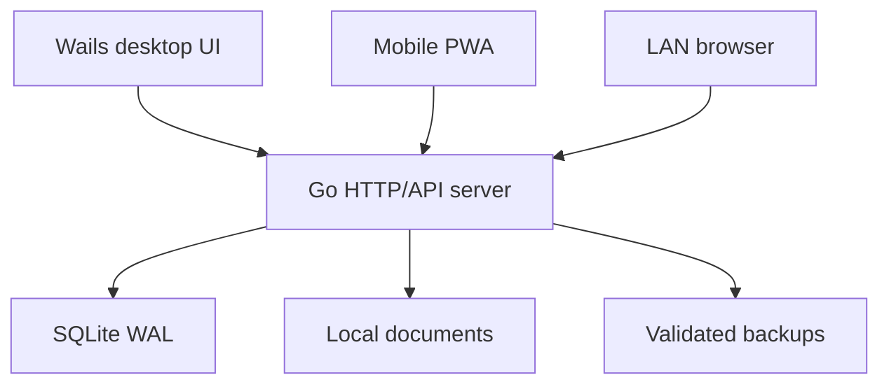

# SentryMed Opti

**Local-first Optical Clinic Management System**

SentryMed Opti is a modular-monolith clinic application built for a small optical/ophthalmology practice. One Go process owns the SQLite database, serves the responsive PWA to the clinic LAN, streams live changes, and powers the Wails desktop shell. Desktop and mobile clients use the same HTTP API and business rules.

> Release status: functional alpha. The persisted arrival → examination → prescription → sale/payment → lab delivery workflow is implemented and tested, but this repository still requires deployment-specific security review and the items documented in [Implementation status](docs/IMPLEMENTATION_STATUS.md) before clinical production use. The software does not claim automatic HIPAA or jurisdictional compliance.

## What works

- first-run clinic and doctor setup with no universal production password;
- Argon2id passwords, server-side sessions, login throttling and doctor/nurse RBAC;
- normalized patients, structured medical/ocular history, appointments and walk-ins;
- live waiting-room stages with SSE updates;
- independently versioned nurse pre-test and doctor encounter sections;
- OD/OS visual acuity, refraction, IOP, diagnoses and signed/locked encounters;
- spectacle/contact-lens/medication prescription records;
- local document upload/download with SQLite metadata and filesystem content;
- frames, lenses, contacts, accessories and services with immutable stock ledger;
- supplier and purchase-order workspaces with transactional partial/full receiving;
- physical stock-take sessions with expected/count/difference reconciliation;
- POS, invoices, immutable partial payments, receipts, refunds and cash sessions;
- optical lab Kanban, advanced fitting values, QC gate and delivery status;
- expenses, financial summaries, live charts and branded report/CSV/PDF-print export;
- clinic-wide search, audit logs and configurable clinic identity;
- manual and scheduled SQLite-safe backups, retention and guarded restore;
- installable, touch-first PWA with compact header, drawer and bottom navigation;
- automatic local HTTPS with a persistent clinic CA and downloadable trust certificate;
- Wails desktop host with the built PWA embedded in the binary and a plug-and-play Windows installer workflow.

## Architecture



Only Go opens SQLite. All clients—including the Wails window—use the same server services. See [Architecture](docs/ARCHITECTURE.md), [Database](docs/DATABASE.md), and [API](docs/API.md).

## Technology

- Go 1.25+
- Wails 2.15
- Chi + `database/sql`
- SQLite through the pure-Go `modernc.org/sqlite` driver
- React 19, TypeScript strict mode and Vite 7
- Tailwind CSS 4 with shadcn/Radix component patterns
- Vitest and Playwright

## Prerequisites

- Go 1.25 or newer
- Node.js 24 and npm 11
- Wails platform dependencies for the desktop target
- Wails CLI for desktop packaging:

```bash
go install github.com/wailsapp/wails/v2/cmd/wails@v2.15.0
```

Run `wails doctor` to validate WebView and native build dependencies for the current OS.

## Development setup

```bash
git clone https://github.com/synapsbranch-ux/sentrymedoptidesktop.git
cd sentrymedoptidesktop

cd apps/web
npm ci
cd ../..

# Terminal 1: Go server, local ./data directory
go run ./cmd/sentrymed --dev

# Terminal 2: Vite with API proxy
cd apps/web
npm run dev
```

Open `http://localhost:5173`. On a clean database the setup wizard collects clinic identity, doctor credentials, currency and timezone.

### Development-only seed

Seed data is opt-in and never runs in production initialization:

```bash
export SENTRYMED_DATA_DIR="$(pwd)/data-dev"
go run ./cmd/sentrymed --seed
go run ./cmd/sentrymed
```

Development accounts:

| Role | Username | Password |
|---|---|---|
| Doctor | `doctor.dev` | `Doctor-Development-Only-2026` |
| Nurse | `nurse.dev` | `Nurse-Development-Only-2026` |

Never use seed credentials for a clinic deployment.

## Production-style local server

Build the PWA before starting the standalone Go server:

```bash
make web
go run ./cmd/sentrymed
```

The default listener is `:8787`. Override it with `SENTRYMED_ADDRESS`, for example `127.0.0.1:8787` to prevent LAN access or `:8787` to allow it. Override storage with `SENTRYMED_DATA_DIR`.

The data directory defaults to the OS user configuration directory plus `SentryMed`:

```text
SentryMed/
├── database/sentrymed.db
├── documents/
├── backups/
└── logs/sentrymed.log
```

## Responsive PWA and LAN access

The Go process serves the production PWA from the same origin as `/api/v1`. In **System → Mobile & network**, scan the detected LAN URL QR code from a phone on the clinic Wi-Fi. The mobile UI uses a bottom navigation and full-screen touch forms; desktop uses the full sidebar and wider data layouts.

Production startup automatically creates a persistent clinic CA and serves HTTPS with a certificate valid for the detected LAN addresses. Download the CA from **System → Mobile & network**, install it once on each authorized device, then scan the QR code. Set `SENTRYMED_AUTO_TLS=false` only for development, or supply `SENTRYMED_TLS_CERT` and `SENTRYMED_TLS_KEY` to use a managed certificate. See [Deployment](docs/DEPLOYMENT.md).

## Tests

```bash
# Backend, migrations, security, concurrency, POS and restore
go test ./...

# Frontend unit tests and build
cd apps/web
npm test -- --run
npm run build
npm run typecheck:e2e

# One mobile-viewport end-to-end clinic workflow
npx playwright install chromium
npm run test:e2e
```

The E2E flow signs in, creates Marie Joseph, schedules/checks in, saves pre-test and consultation data, issues and locks a prescription, completes a partial-payment POS sale, advances a QC-gated lab order, delivers it, and verifies the patient timeline.

## Building

Standalone server:

```bash
make build
./build/bin/sentrymed-server
```

Desktop application:

```bash
wails build
```

For a plug-and-play per-user Windows installer, run `./scripts/build-windows-installer.ps1` in PowerShell or trigger the **Windows installer** GitHub Actions workflow and download its NSIS artifact. It is unsigned until a publisher certificate is configured, so Windows may display an unknown-publisher warning.

## Migrations

Migrations are embedded from `internal/database/migrations` and applied in numeric order on startup. Applied versions are recorded in `schema_migrations`. Never edit an installed clinic database manually; add the next immutable migration instead.

## Backups and restore

Backups use SQLite `VACUUM INTO`, then run `PRAGMA integrity_check` and store a SHA-256 checksum. Automatic policy defaults to every four hours with 30-day automatic-backup retention. Restore is doctor-only, blocks API writes, creates a pre-restore safety snapshot, validates the source, swaps the database portably, reopens it, and runs an integrity check; failed validation recovers the previous database.

Keep a tested copy on a separate encrypted disk or controlled network location. A backup stored only on the clinic computer is not disaster recovery.

## Repository map

```text
cmd/sentrymed/                  standalone Go server
internal/app/                   local configuration and directories
internal/database/              SQLite connection and migration runner
internal/server/                API, auth, RBAC and clinic business rules
internal/backup/                snapshot, restore and scheduler
internal/realtime/              server-sent event broker
apps/web/                       shared desktop/PWA React client
apps/web/e2e/                   mobile Playwright acceptance flow
docs/                           architecture, database, API and deployment
main.go                         Wails desktop entry point
```

## Useful commands

```bash
make api       # Go server using ./data
make dev       # Vite client
make web       # npm ci + production PWA build
make test      # Go + frontend unit tests
make build     # standalone server
make installer-windows # NSIS installer on Windows
make seed      # explicit development data
```
