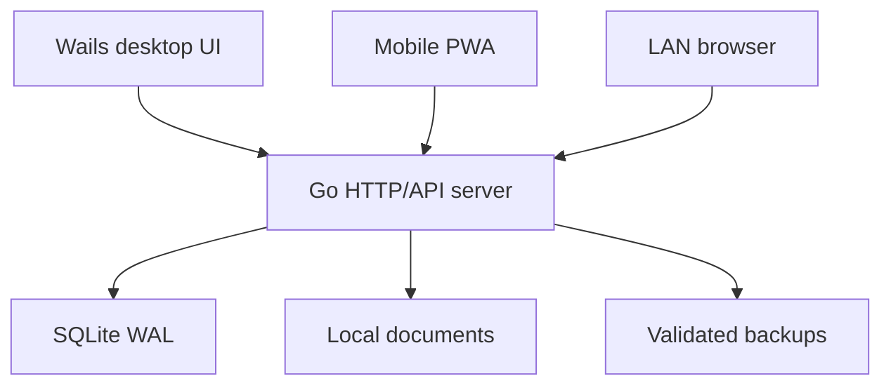

# SentryMed Opti

**Local-first Optical Clinic Management System**

SentryMed Opti is a modular-monolith clinic application built for a small optical/ophthalmology practice. One Go process owns the SQLite database, serves the responsive PWA to the clinic LAN, streams live changes, and powers the Wails desktop shell. Desktop and mobile clients use the same HTTP API and business rules.

> Release status: functional alpha. The persisted arrival → examination → prescription → sale/payment → lab delivery workflow is implemented and tested, but this repository still requires deployment-specific security review and the items documented in [Implementation status](docs/IMPLEMENTATION_STATUS.md) before clinical production use. The software does not claim automatic HIPAA or jurisdictional compliance.

## What works

- first-run clinic and doctor setup with no universal production password;
- Argon2id passwords, server-side sessions, login throttling and doctor/nurse RBAC;
- normalized patients, structured medical/ocular history, appointments and walk-ins;
- live waiting-room stages with SSE updates;
- independently versioned nurse pre-test and doctor encounter sections;
- OD/OS visual acuity, refraction, IOP, diagnoses and signed/locked encounters;
- spectacle/contact-lens/medication prescription records;
- local document upload/download with SQLite metadata and filesystem content;
- frames, lenses, contacts, accessories and services with immutable stock ledger;
- supplier and purchase-order workspaces with transactional partial/full receiving;
- physical stock-take sessions with expected/count/difference reconciliation;
- POS, invoices, immutable partial payments, receipts, refunds and cash sessions;
- manual offline insurance claims, insurer payments and receivable aging;
- guided refunds, automatic credit notes and transactional product returns;
- optical lab Kanban, advanced fitting values, QC gate and delivery status;
- expenses, financial summaries, live charts and branded report/CSV/PDF-print export;
- clinic-wide search, audit logs and configurable clinic identity;
- manual and scheduled SQLite-safe backups, retention and guarded restore;
- installable, touch-first PWA with compact header, drawer and bottom navigation;
- automatic local HTTPS with a persistent clinic CA and downloadable trust certificate;
- Wails desktop host with the built PWA embedded in the binary and a plug-and-play Windows installer workflow.
- native Windows system-tray controls for the clinic server.
- server-persisted shadcn base/accent themes with light, dark and device modes;
- a privacy-filtered live waiting-room display for a clinic TV or tablet at `/display`.

## Architecture



Only Go opens SQLite. All clients—including the Wails window—use the same server services. See [Architecture](docs/ARCHITECTURE.md), [Database](docs/DATABASE.md), and [API](docs/API.md).

## Technology

- Go 1.25+
- Wails 2.15
- Chi + `database/sql`
- SQLite through the pure-Go `modernc.org/sqlite` driver
- React 19, TypeScript strict mode and Vite 7
- Tailwind CSS 4 with shadcn/Radix component patterns
- Vitest and Playwright

## Local installation

Choose one of these installation paths:

- **Clinic/end user on Windows:** use the generated installer. Go and Node.js are not required on the clinic computer.
- **Developer or source installation:** follow the Windows, macOS or Fedora guide below. This builds the desktop application locally.
- **Backend/PWA development:** follow [Run in development](#run-in-development) after completing the source prerequisites for your OS.

The source build currently requires:

- a 64-bit operating system;
- Git;
- Go 1.25 or newer;
- Node.js 24 and npm 11;
- the native WebView/build dependencies required by Wails 2.15.

Check the versions before continuing:

```bash
git --version
go version
node --version
npm --version
```

Use the official [Go downloads](https://go.dev/dl/) and [Node.js downloads](https://nodejs.org/en/download) if your operating-system packages do not provide the required major versions.

### Fedora Linux — step by step

This is the primary Linux development path for this repository. The commands below are intended for a current Fedora Workstation release.

1. Update Fedora and install the native Wails dependencies:

   ```bash
   sudo dnf upgrade --refresh
   sudo dnf install -y \
     git gcc gcc-c++ pkgconf-pkg-config \
     gtk3-devel webkit2gtk4.1-devel \
     gstreamer1-plugins-good
   ```

   If `webkit2gtk4.1-devel` is not available on an older Fedora release, inspect the available package and install the 4.0 development package instead:

   ```bash
   dnf search webkit2gtk
   sudo dnf install -y webkit2gtk4.0-devel
   ```

2. Install Go 1.25+ and Node.js 24/npm 11 using their official installers if they are not already available. Then verify them:

   ```bash
   go version
   node --version
   npm --version
   ```

3. Install the Wails CLI and make sure the Go binary directory is on this shell's `PATH`:

   ```bash
   go install github.com/wailsapp/wails/v2/cmd/wails@v2.15.0
   export PATH="$PATH:$(go env GOPATH)/bin"
   wails doctor
   ```

   Fedora 40+ uses the WebKitGTK 4.1 ABI. Some Wails 2 Doctor releases can still report `libwebkit: Unknown / Not Found` even after the correct Fedora package is installed. Confirm the ABI directly:

   ```bash
   pkg-config --modversion webkit2gtk-4.1
   npm --version
   ```

   If both commands print a version, continue and build with the explicit `webkit2_41` tag. A Doctor row showing an npm version but `Package Name: Unknown` usually means npm was installed outside DNF; it is not a blocker when `npm --version` and `npm ci` succeed.

   To keep the Go binary PATH change after restarting the terminal:

   ```bash
   echo 'export PATH="$PATH:$(go env GOPATH)/bin"' >> ~/.bashrc
   source ~/.bashrc
   ```

4. Clone and build SentryMed Opti:

   ```bash
   git clone https://github.com/synapsbranch-ux/sentrymedoptidesktop.git
   cd sentrymedoptidesktop
   npm --prefix apps/web ci
   wails build -clean -tags webkit2_41
   ```

5. Start the built desktop application:

   ```bash
   ./build/bin/SentryMed-Opti
   ```

   Keep this application running: its Go process is also the clinic server used by phones and other computers.

6. Optional—allow phones and laptops on the trusted clinic LAN to reach the server:

   ```bash
   sudo firewall-cmd --permanent --add-port=8787/tcp
   sudo firewall-cmd --reload
   sudo firewall-cmd --list-ports
   ```

   Open only the configured SentryMed port, only on a trusted clinic network. Do not disable SELinux or the firewall. If you change `SENTRYMED_ADDRESS`, open the corresponding port instead.

7. Complete [First launch](#first-launch) and then use **System → Mobile & network** to obtain the HTTPS URL, QR code and clinic CA certificate.

To rebuild after pulling an update:

```bash
git pull --ff-only
npm --prefix apps/web ci
wails build -clean -tags webkit2_41
```

Back up the clinic data before every application upgrade.

### Windows — installer (recommended for clinic use)

The Windows installer is per-user and does not require administrator access for the normal installation.

1. Open the repository's **Actions** page on GitHub.
2. Open a successful **Windows installer** workflow run.
3. Download its installer artifact and unzip it.
4. Double-click the generated `*-installer.exe` file.
5. Because the installer is not commercially code-signed yet, Windows SmartScreen may display **Unknown publisher**. Choose **More info → Run anyway** only when the installer was downloaded from this official repository.
6. Finish installation and launch **SentryMed Opti** from the Start menu.
7. If Windows Firewall asks for access, allow **Private networks** for clinic LAN/mobile access; do not enable Public networks.
8. Complete [First launch](#first-launch).

To remove the application later, use **Settings → Apps → Installed apps → SentryMed Opti → Uninstall**. Uninstalling the program should not be treated as a backup procedure: preserve the SentryMed data directory separately.

### Windows — build the installer from source

1. Install 64-bit Git, Go 1.25+, Node.js 24/npm 11 and [NSIS](https://nsis.sourceforge.io/Download). Microsoft Edge WebView2 is normally present on supported Windows versions; `wails doctor` will report if it is missing.
2. Open PowerShell and verify the tools:

   ```powershell
   git --version
   go version
   node --version
   npm --version
   makensis /VERSION
   ```

3. Install and validate Wails:

   ```powershell
   go install github.com/wailsapp/wails/v2/cmd/wails@v2.15.0
   $env:Path += ";$(go env GOPATH)\bin"
   wails doctor
   ```

4. Clone the repository and build the installer:

   ```powershell
   git clone https://github.com/synapsbranch-ux/sentrymedoptidesktop.git
   Set-Location sentrymedoptidesktop
   Set-ExecutionPolicy -Scope Process Bypass
   .\scripts\build-windows-installer.ps1
   ```

5. Find the generated installer under `build\bin`, run it, and follow the Windows installer steps above.

### macOS — step by step

1. Install Apple's Command Line Tools:

   ```bash
   xcode-select --install
   ```

2. Install Go 1.25+ and Node.js 24/npm 11 from their official downloads, then verify all tools:

   ```bash
   git --version
   go version
   node --version
   npm --version
   ```

3. Install and validate Wails:

   ```bash
   go install github.com/wailsapp/wails/v2/cmd/wails@v2.15.0
   export PATH="$PATH:$(go env GOPATH)/bin"
   wails doctor
   ```

4. Clone and build the application:

   ```bash
   git clone https://github.com/synapsbranch-ux/sentrymedoptidesktop.git
   cd sentrymedoptidesktop
   npm --prefix apps/web ci
   wails build -clean
   ```

5. Launch the app directly from the build directory:

   ```bash
   open "build/bin/SentryMed-Opti.app"
   ```

6. For a local installation, copy `build/bin/SentryMed-Opti.app` into `/Applications`. Because locally built development binaries are not commercially signed/notarized, the first launch may require Control-clicking the app in Finder and choosing **Open**.
7. Complete [First launch](#first-launch). If macOS asks whether SentryMed may accept incoming network connections, allow it only for the trusted clinic LAN.

### First launch

On an empty production data directory, SentryMed opens its setup wizard. Complete it in this order:

1. enter the clinic name, contact details and timezone;
2. create the doctor's username and a strong unique password—there is no default production password;
3. configure the base currency and optional secondary currency/exchange rate;
4. upload the clinic logo if desired;
5. choose and validate the backup destination;
6. sign in as the doctor and create nurse/user accounts under **System → Users**;
7. open **System → Mobile & network** and confirm the server URL before connecting phones.

The application may request firewall/network, file or notification permissions depending on the operating system. Grant only permissions needed for the clinic server, selected document folder and selected backup destination.

Default production data locations are:

| System | Default directory |
|---|---|
| Fedora/Linux | `~/.config/SentryMed` or `$XDG_CONFIG_HOME/SentryMed` |
| macOS | `~/Library/Application Support/SentryMed` |
| Windows | `%AppData%\SentryMed` |

Inside that directory, the database is stored at `database/sentrymed.db`; documents, backups and logs have separate subdirectories. Set `SENTRYMED_DATA_DIR` before launch to use another root directory. The configurable backup destination can point to a separate authorized USB disk or network folder.

## Run in development

After completing the source prerequisites for your operating system:

```bash
git clone https://github.com/synapsbranch-ux/sentrymedoptidesktop.git
cd sentrymedoptidesktop
npm --prefix apps/web ci

# Terminal 1: Go server, local ./data directory
go run ./cmd/sentrymed --dev

# Terminal 2: Vite UI with API proxy
npm --prefix apps/web run dev
```

Open `http://localhost:5173`. Development mode deliberately uses HTTP and the repository-local `./data` directory. Production desktop builds use the operating-system data directory and automatic local HTTPS.

### Development-only seed

Seed data is opt-in and never runs in production initialization:

```bash
export SENTRYMED_DATA_DIR="$(pwd)/data-dev"
go run ./cmd/sentrymed --seed
go run ./cmd/sentrymed
```

Development accounts:

| Role | Username | Password |
|---|---|---|
| Doctor | `doctor.dev` | `Doctor-Development-Only-2026` |
| Nurse | `nurse.dev` | `Nurse-Development-Only-2026` |

Never use seed credentials for a clinic deployment.

## Production-style local server

Build the PWA before starting the standalone Go server:

```bash
make web
go run ./cmd/sentrymed
```

The default listener is `:8787`. Override it with `SENTRYMED_ADDRESS`, for example `127.0.0.1:8787` to prevent LAN access or `:8787` to allow it. Override storage with `SENTRYMED_DATA_DIR`.

The data directory defaults to the OS user configuration directory plus `SentryMed`:

```text
SentryMed/
├── database/sentrymed.db
├── documents/
├── backups/
└── logs/sentrymed.log
```

## Responsive PWA and LAN access

The Go process serves the production PWA from the same origin as `/api/v1`. In **System → Mobile & network**, scan the detected LAN URL QR code from a phone on the clinic Wi-Fi. The mobile UI uses a bottom navigation, scrollable touch drawer and bottom-sheet forms; desktop uses the full sidebar and wider data layouts. If a mobile client reports that it cannot contact the clinic server, confirm that the desktop process is still running and the phone remains on the clinic Wi-Fi, then use **Reconnect and try again**. The client automatically falls back to a lightweight revision poll if the live SSE connection is interrupted.

Use **System → Themes** to select a shadcn base palette, accent, light/dark/device mode and corner radius. This setting is stored in SQLite and applied to authenticated desktop and LAN clients. Use **System → Public display** to enable the privacy-filtered waiting-room screen, choose queue-number/initials/first-name identification, and obtain the TV URL and QR code. Open `<clinic-server-url>/display` on a clinic-owned display device.

Production startup automatically creates a persistent clinic CA and serves HTTPS with a certificate valid for the detected LAN addresses. Download the CA from **System → Mobile & network**, install it once on each authorized device, then scan the QR code. Set `SENTRYMED_AUTO_TLS=false` only for development, or supply `SENTRYMED_TLS_CERT` and `SENTRYMED_TLS_KEY` to use a managed certificate. See [Deployment](docs/DEPLOYMENT.md).

## Tests

```bash
# Backend, migrations, security, concurrency, POS and restore
go test ./...

# Frontend unit tests and build
cd apps/web
npm test -- --run
npm run build
npm run typecheck:e2e

# One mobile-viewport end-to-end clinic workflow
npx playwright install chromium
npm run test:e2e
```

The E2E flow signs in, creates Marie Joseph, schedules/checks in, saves pre-test and consultation data, issues and locks a prescription, completes a partial-payment POS sale, advances a QC-gated lab order, delivers it, and verifies the patient timeline.

## Building

Standalone server:

```bash
make build
./build/bin/sentrymed-server
```

Desktop application:

```bash
wails build
```

For a plug-and-play per-user Windows installer, run `./scripts/build-windows-installer.ps1` in PowerShell or trigger the **Windows installer** GitHub Actions workflow and download its NSIS artifact. It is unsigned until a publisher certificate is configured, so Windows may display an unknown-publisher warning.

## Migrations

Migrations are embedded from `internal/database/migrations` and applied in numeric order on startup. Applied versions are recorded in `schema_migrations`. Never edit an installed clinic database manually; add the next immutable migration instead.

## Backups and restore

Backups use SQLite `VACUUM INTO`, then run `PRAGMA integrity_check` and store a SHA-256 checksum. Automatic policy defaults to every four hours with 30-day automatic-backup retention. Restore is doctor-only, blocks API writes, creates a pre-restore safety snapshot, validates the source, swaps the database portably, reopens it, and runs an integrity check; failed validation recovers the previous database.

Keep a tested copy on a separate encrypted disk or controlled network location. A backup stored only on the clinic computer is not disaster recovery.

## Repository map

```text
cmd/sentrymed/                  standalone Go server
internal/app/                   local configuration and directories
internal/database/              SQLite connection and migration runner
internal/server/                API, auth, RBAC and clinic business rules
internal/backup/                snapshot, restore and scheduler
internal/realtime/              server-sent event broker
apps/web/                       shared desktop/PWA React client
apps/web/e2e/                   mobile Playwright acceptance flow
docs/                           architecture, database, API and deployment
main.go                         Wails desktop entry point
```

## Useful commands

```bash
make api       # Go server using ./data
make dev       # Vite client
make web       # npm ci + production PWA build
make test      # Go + frontend unit tests
make build     # standalone server
make installer-windows # NSIS installer on Windows
make seed      # explicit development data
```
