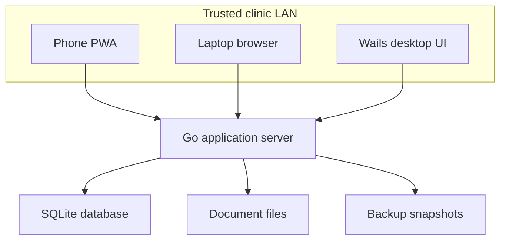
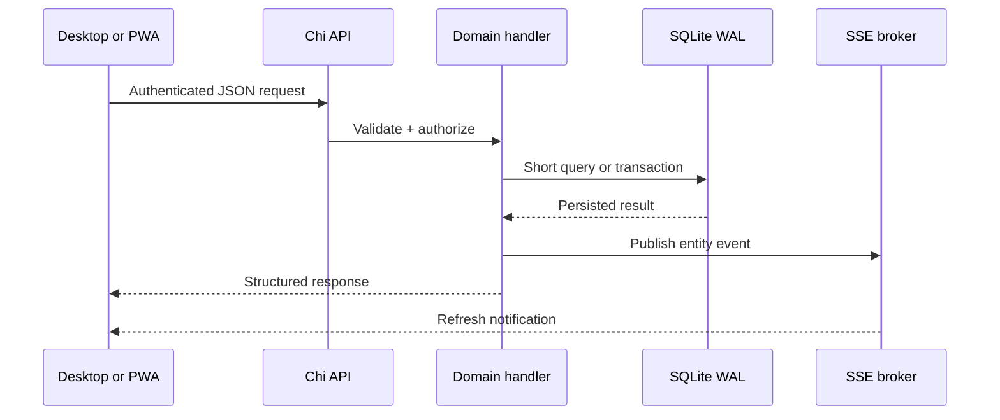

# Architecture

## System topology

The Wails executable is both desktop client and clinic server. Its compiled React assets are embedded in the executable and are also served to LAN browsers. Native bindings are intentionally limited to desktop-only behaviors such as window management and opening the backup folder. Clinic business operations are HTTP calls, so there is one authorization and transaction path.

## Modular monolith

SentryMed Opti is one process, one database and one deployment unit. Modules are separated inside Go by concern rather than by network boundaries:

- identity, sessions and RBAC;
- patients and history;
- appointments and queue;
- encounters and prescriptions;
- documents;
- inventory, suppliers and purchasing;
- POS, billing, payments and cash register;
- lab orders;
- finance and reporting;
- audit, settings and backup.

This is deliberately sized for two normal concurrent users and a maximum of roughly four. Microservices would add failure modes without helping this clinic workload.

## Request path

Handlers validate all input and enforce role restrictions before writes. Errors have stable codes such as `CONCURRENT_MODIFICATION`. Mutations publish a lightweight SSE event; subscribed clients reload the relevant server-backed data.

## Concurrency

SQLite uses WAL, foreign keys, a five-second busy timeout and at most four pooled connections. Transactions contain only SQL work and do not remain open while a form is displayed.

Important mutable rows carry `version`, `updated_at` and `updated_by`. Updates include the version in their `WHERE` clause and increment it. Zero affected rows produce HTTP 409. The nurse pre-test, doctor encounter header and each encounter examination section use separate rows and versions. This permits legitimate simultaneous work while still rejecting two saves against the same entity version.

Finalizing an encounter changes it to an immutable state. Later corrections are append-only addenda.

## Local-first behavior

Operational code has no required Internet dependency. The browser needs only a route to the server computer. SQLite, documents, audit data, reports, assets and backups are local. The service worker caches the application shell but never treats browser storage as the clinical database.

## Security boundaries

- Only Go receives SQLite and filesystem access.
- Sessions use a random opaque token; only its SHA-256 hash is stored.
- Passwords use Argon2id.
- Nurse/doctor authorization is enforced by route middleware and encounter state checks.
- Setup can only be completed from the server computer.
- Critical actions are written to the audit log.
- Restore acquires the server maintenance write lock; normal requests and the backup scheduler cannot race the database swap.

The default HTTP listener is appropriate only for a controlled clinic LAN. TLS termination, host firewall rules, workstation hardening, OS encryption, access review and tested off-device backups are deployment responsibilities.

## Desktop lifecycle

Startup creates application directories, opens SQLite, verifies pragmas, applies migrations, checks integrity, starts the backup scheduler and HTTP server, then opens Wails. On Windows, where the native notification-area menu is available, closing the main window minimizes it and keeps the server running; **Exit** shuts the HTTP server down. On Linux and macOS builds without that tray implementation, closing the window performs a bounded graceful shutdown and exits so the process cannot become inaccessible in the background.

The public waiting-room display is served by the same process at `/display`. Its unauthenticated read model is deliberately separate from the authenticated chart API: it emits only generated queue codes and the doctor-configured masked label. It never exposes patient IDs, medical record numbers, clinical content, contacts or financial information. Both SSE invalidation and a periodic refresh keep the display current on ordinary clinic LAN hardware.
