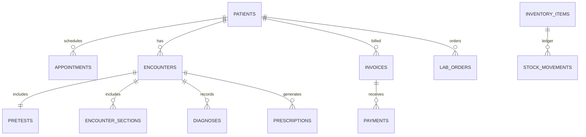

# Database

## Location and connection

The database is `<data-directory>/database/sentrymed.db`. Only the Go server opens it. Every connection is configured with:

```sql
PRAGMA journal_mode=WAL;
PRAGMA foreign_keys=ON;
PRAGMA busy_timeout=5000;
PRAGMA synchronous=NORMAL;
```

The pool is capped at four open/idle connections, matching the intended clinic workload. Canonical timestamps are RFC 3339 UTC strings; clients convert them for display.

## Main relationships



## Table groups

| Concern | Principal tables |
|---|---|
| Identity | `users`, `sessions`, `login_attempts` |
| Configuration | `settings`, `branding_assets`, `sequences`, `schema_migrations` |
| Audit | `audit_logs` |
| Patient chart | `patients`, `patient_histories`, `patient_allergies`, `patient_medications`, `patient_emergency_contacts`, `patient_insurance` |
| Scheduling | `appointments`, `queue_entries` |
| Clinical | `encounters`, `pretests`, `encounter_sections`, `diagnoses`, `encounter_addenda`, `prescriptions` |
| Files | `documents` |
| Supply | `suppliers`, `inventory_items`, `stock_movements`, `purchase_orders`, `purchase_order_items`, `purchase_order_receipts`, `purchase_order_receipt_items`, `stock_take_sessions`, `stock_take_items` |
| Billing | `invoices`, `invoice_items`, `payments`, `refunds`, `credit_notes`, `payment_methods` |
| Cash/expense | `cash_register_sessions`, `expenses` |
| Optical lab | `lab_orders`, `lab_status_history`, `lab_quality_control` |
| Third party | `payers`, `patient_insurance`, `insurance_claims`, `insurance_claim_payments` |
| Recovery | `backup_records` |

Large document content is not stored as BLOBs. `documents` contains metadata, SHA-256 and an opaque storage name; bytes live under `<data-directory>/documents`.

## Identifiers and money

Internal identifiers are UUIDs. A transaction-protected `sequences` row generates human references such as `PT-000001`, `INV-2026-000001`, `RCT-2026-000001`, `RX-2026-000001` and `LAB-2026-000001`.

Money uses integer minor units. Currency and the transaction exchange-rate text are stored on each invoice, payment and expense; the rate means base-currency units per transaction-currency unit. A payment currently uses the same currency as its invoice, avoiding ambiguous cross-currency balance arithmetic, while reports convert with each stored historical rate and retain per-currency totals. Payments are immutable rows; paid and balance amounts are aggregates rather than an overwritten invoice column.

## Optimistic locking

Mutable entities use this pattern:

```sql
UPDATE patients
SET notes = ?, version = version + 1, updated_at = ?, updated_by = ?
WHERE id = ? AND version = ? AND archived_at IS NULL;
```

No affected row means the client is stale. The API returns HTTP 409 and does not merge or discard data. Independent clinical sections have independent versions.

## Inventory and billing invariants

Inventory quantity may only change alongside a `stock_movements` row explaining previous, delta and resulting quantity. POS checkout creates the invoice, line items, optional payment/receipt and stock deductions inside one transaction. Purchase-order receiving similarly updates receipt records, received quantities, on-hand inventory and purchase movements atomically. Stock-take finalization verifies that on-hand values still equal the captured snapshots before creating audited correction movements.

## Migrations and indexes

SQL files in `internal/database/migrations` use a numeric prefix. Startup creates `schema_migrations`, checks applied versions and runs each pending migration in a short transaction.

Indexes cover session tokens/expiry, patient names/phones/creation, appointment date/status, queue stage, encounter patient/status, prescription patient, documents patient, inventory names and stock, stock movement chronology, invoice number/status/patient, payment receipt/invoice, expenses date, and lab status/patient.

## Backup and restore

`VACUUM INTO` creates a transactionally consistent standalone snapshot that includes committed WAL content. Each file is opened read-only for `PRAGMA integrity_check`, SHA-256 hashed, and registered in `backup_records`.

Restore validates the registered checksum and integrity, creates a pre-restore snapshot, acquires maintenance mode, checkpoints/truncates WAL, closes SQLite, preserves the current main file, installs the snapshot, reopens and verifies. If open or verification fails, it restores the preserved database. Scheduled backups read their interval/retention from `settings.backup` each minute; only expired automatic snapshots are pruned.

## Migration 017: integrity and recovery safeguards

`017_integrity_guards.sql` adds atomic appointment-overlap checks, finalized-record guards on consultation children, and a guard against disabling the last active doctor. Existing finalized data and existing overlapping appointments are not rewritten. Existing overlaps require staff review when edited; the migration does not choose a clinical schedule automatically.

New `idempotency_records` and `invoice_return_items` tables make supported financial retries and repeated full-line restocking safe. Legacy refunds do not identify returned line IDs reliably: invoices with older restocked credit notes require a stock review before further automatic restocking. Financial refunds without restocking remain available. The new marker applies to returns recorded after this migration. `backup_records.assets_checksum` identifies complete file bundles; an empty value denotes a legacy database-only snapshot. `backup_status` records the last automatic check/error. Legacy database-configured transcription commands are removed.

SQLite uses WAL, foreign keys and `synchronous=FULL`. Backup/restore includes documents, consultation recordings, branding and signatures. Keep each `.db` and matching `.db.files` directory together. Restore stages and checks assets before swapping, preserves originals through reopening, retains recovery catalog entries, and invalidates restored sessions. See DEPLOYMENT.md for upgrade and recovery procedures; a database/file restore is not an atomic filesystem transaction across a power loss.
